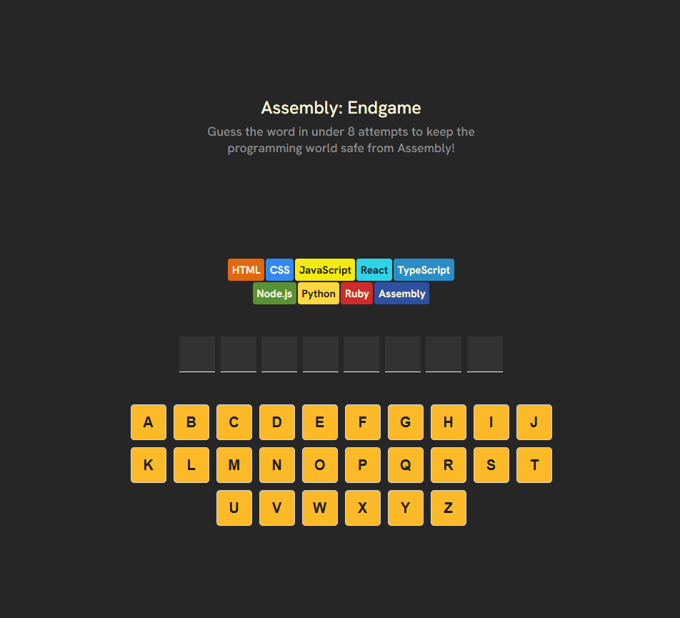
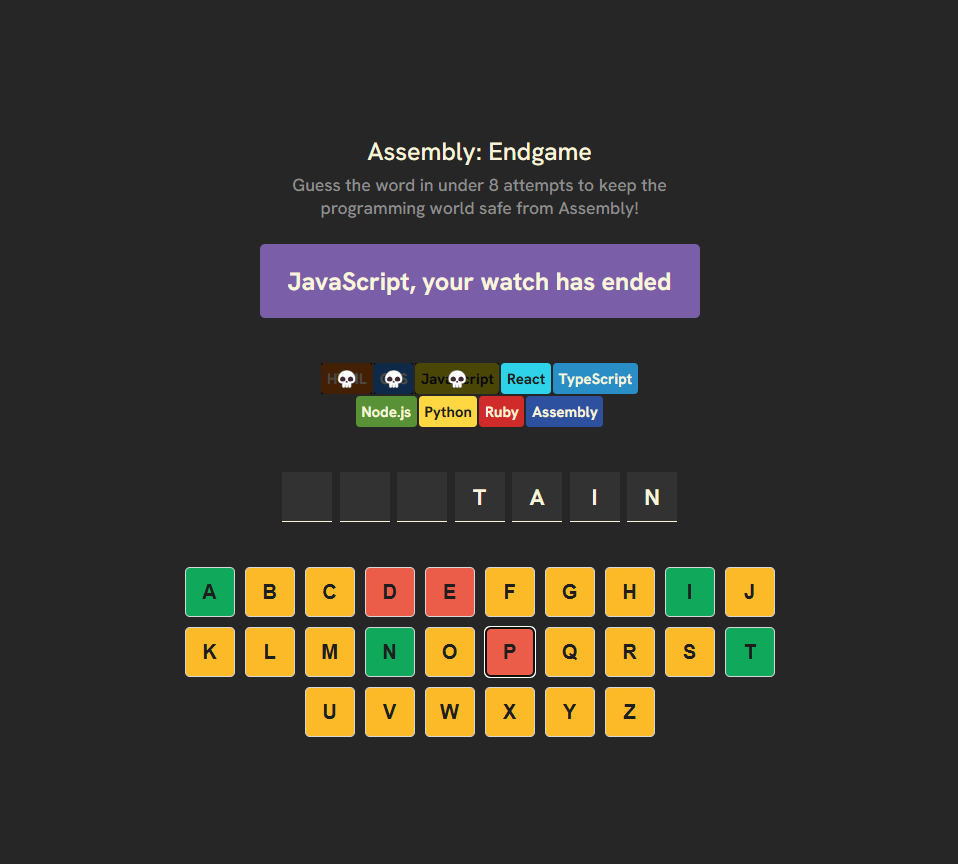
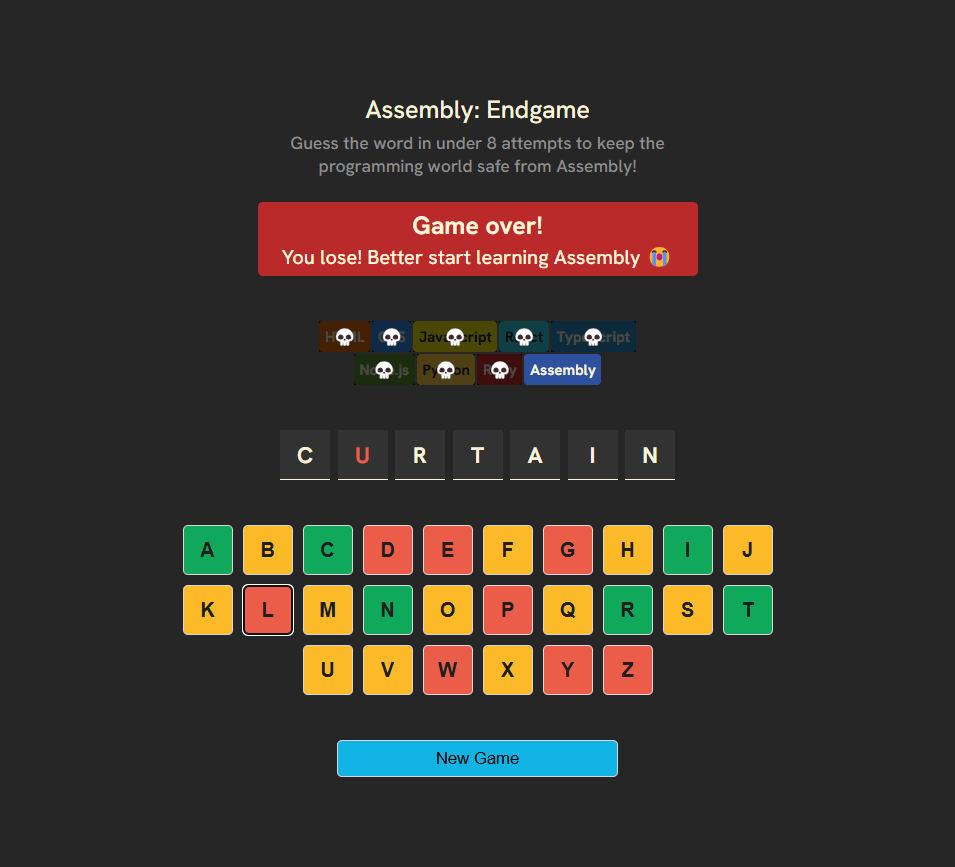
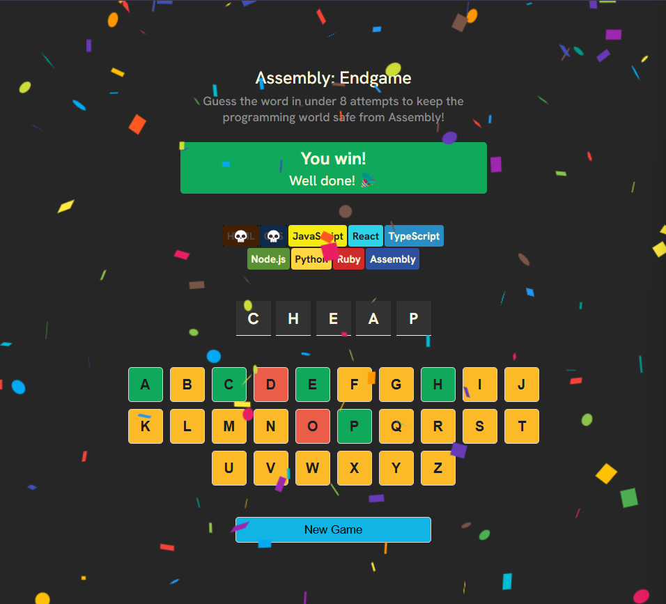

# Assembly Endgame

Assembly Endgame is a word-guessing game where you must identify a random word before all programming languages are wiped out, leaving only **Assembly**! You have **8 wrong attempts**—choose wisely.

## Gameplay

- A **random word** is generated at the start of the game.
- Players interact using **on-screen buttons** to guess letters.
- Each wrong guess eliminates a programming language.
- Win by guessing the word before running out of chances.
- **Lose all 8 chances**, and Assembly takes over the world!

## Play at [Assembly Endgame](https://prachi1025.github.io/React-Assembly-Endgame-App/)
## Gameplay Screenshots

## Features

- 🎯 **On-screen keyboard** for letter selection.
- 🎉 **Confetti effect** when you win.
- 🔄 **New Game button** appears after a win.
- 😞 **Custom message** when you lose.
- 🎨 **Styled with dynamic classnames (`clsx`)**.
- ⚛️ **Built with React (Vite) and external libraries**.

## Technologies Used

- **React (Vite)**
- **clsx** (for conditional classnames)
- **react-confetti** (for the victory celebration)

---

Can you stop Assembly from taking over? Start guessing now!
